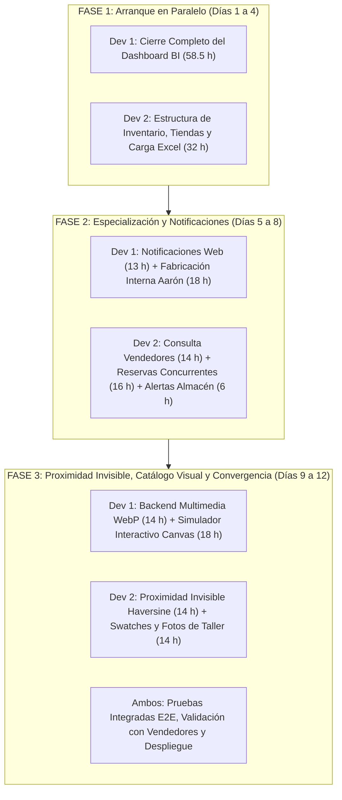

# Plan Maestro de Distribución de Tareas por Desarrollador y Fases

**Proyecto:** Sistema de Gestión Camihogar (.NET 10 + React / Vite)  
**Fecha:** 21 de Septiembre de 2026  
**Estrategia de Ejecución:** Trabajo paralelo asistido por **OpenCode (capa Zen)**, equilibrado en fases sucesivas para evitar tiempos muertos.  
**Premisa Operativa:** Como el Dashboard de BI se completa en menor tiempo que el Inventario, el **Desarrollador 1** se libera primero para asumir el módulo de **Notificaciones Web**, la **Fabricación Interna (Aarón)** y colaborar en el **Catálogo Visual**, logrando un reparto exacto del 50/50 del esfuerzo total.

---

## 1. Balance General de Carga de Trabajo (217.5 Horas Restantes)

| Desarrollador | Módulos Asignados | Horas Tradicionales | Horas Efectivas Zen (~2.5x) | % del Total |
|---|---|:---:|:---:|:---:|
| **Desarrollador 1** | **BI Dashboard** + **Notificaciones Web** + **Fabricación Interna** + **Backend Fotos & Simulador Canvas** | **105 h** | **~40 a 42 h** | **48.3%** |
| **Desarrollador 2** | **CRUD Almacenes/Tiendas/Roles** + **Carga Excel** + **Reservas Concurrentes** + **Proximidad Invisible Haversine** + **Swatches & Galería Taller** | **112.5 h** | **~43 a 45 h** | **51.7%** |
| **TOTALES** | **38 Requerimientos Consolidados (100% de la Minuta y el Plan)** | **217.5 h** | **~83 a 87 h efectivas** | **100%** |

---

## 2. Plan Detallado: Desarrollador 1

### FASE 1: Finalización Integral del Dashboard de BI (58.5 h trad. / ~22 h Zen)
*El Dev 1 arranca cerrando todas las métricas analíticas pendientes para entregar el Dashboard 100% funcional.*

1. **Finanzas y Liquidez:**
   - [ ] **Saldos Pendientes por Cobrar (Aging) (3.5 h):** Agrupación de cuentas por cobrar en pedidos terminados (0-7 d, 8-15 d, 15+ d).
   - [ ] **Mix de Medios de Pago y Exposición Divisas (4 h):** Gráfica de distribución de recaudación: Efectivo USD, Zelle, Transferencias en Bs y Tarjetas.
   - [ ] **Top Vendedores y Comisiones (1.5 h):** Liquidación de comisiones acumuladas por vendedor según cobranza real.
   - [ ] **Ticket Promedio (AOV) por Sede (1.5 h):** Desglose comparativo Guatire vs Caracas.
2. **Eficiencia Operativa:**
   - [ ] **Manufacturing Lead Time (10 h):** Tiempo promedio de fabricación por categoría (Camas vs Closets vs Comedores).
   - [ ] **OTIF (On-Time In-Full) (8 h):** % de cumplimiento de fechas pactadas con el cliente vs entrega real.
   - [ ] **Cuellos de Botella (8 h):** Tiempo medio de permanencia en cada etapa de fabricación.
   - [ ] **Pipeline de Estados (1 h):** Ajustes finales al flujo visual de órdenes activas.
   - [ ] **Tasa Despacho Inmediato vs Fabricación (6 h):** Proporción de pedidos cubiertos con stock existente vs fabricados a medida.
3. **Funnel de Ventas:**
   - [ ] **Win Rate de Reservas (8 h):** Tasa de conversión de apartados a pedidos pagados.
   - [ ] **Velocidad de Cierre (6 h):** Tiempo promedio desde el registro de la reserva hasta el cobro inicial.
4. **Métricas de Inventario en BI:**
   - [ ] **Rotación de Stock Terminado (8 h):** Días promedio de permanencia de muebles en exhibición y bodega.
   - [ ] **Tasa de Quiebre de Stock (Stockouts) (6 h):** Registro analítico de consultas perdidas por falta de existencia local.
   - [ ] **Ocupación Física de Tiendas (6 h):** % de capacidad ocupada vs tope físico permitido en tienda.
   - [ ] **Motor de Recomendaciones Inteligentes de Reposición (10 h):** Algoritmo que cruza el Top 3 de variantes reales más vendidas contra el inventario disponible para generar alertas automáticas de fabricación prioritaria.

---

### FASE 2: Notificaciones Web y Fabricación Interna (31 h trad. / ~12 h Zen)
*Una vez entregado el Dashboard de BI, el Dev 1 pasa a implementar el sistema de alertas y la reposición interna.*

1. **Centro de Notificaciones Web y Alertas de Negocio (13 h):**
   - [ ] **Centro In-App en Frontend (3 h):** Finalizar campana de notificaciones, contador de mensajes no leídos y panel desplegable con filtrado por rol (Ventas vs Almacén).
   - [ ] **Módulo de Alertas de "Repesca" para Vendedores Online (CRM):** Notificación automática en el panel de notificaciones cuando una orden en estatus *Reserva* (presupuesto) supera los 30 días sin concretarse, permitiendo al equipo online abrir el contacto del cliente y hacer seguimiento comercial para cerrar la venta.
   - [ ] **Alertas Sonoras en Navegador (4 h):** Reproducción de alertas audibles configurables para el personal de despacho y almacén al registrarse movimientos urgentes.
   - [ ] **Disparo Automático de Alertas de Despacho (6 h):** Emisión de eventos SSE cuando una orden cambia a: *Retiro por tienda*, *Retiro por almacén* o *Express*.
2. **Módulo de Fabricación Interna - Aarón (18 h):**
   - [ ] **Flujo de Órdenes de Reposición para Stock/Exhibición (12 h):** Creación de órdenes de producción internas destinadas a stock de tienda (sin cliente final asignado).
   - [ ] **Aislamiento Contable y Financiero (6 h):** Regla estricta para excluir órdenes internas de reposición de los reportes de ventas y facturación de la empresa (evita inflar ingresos ficticios).

---

### FASE 3: Backend Multimedia y Simulador Interactivo (32 h trad. / ~12 h Zen)
*En la recta final, el Dev 1 apoya en el catálogo visual con el motor de imágenes y el simulador.*

1. **Servicio Backend de Alojamiento y Fotos Reales (14 h):**
   - [ ] Endpoint de carga multipart (`/api/gallery/upload`) con compresión automática a formato **WebP**.
   - [ ] Almacenamiento local persistente (`/uploads/gallery/`) y base de datos con etiquetas de búsqueda (modelo, tipo de tela, color, tamaño, pedido real).
2. **Simulador Interactivo de Telas y Acabados (Fase 2 del Catálogo) (18 h):**
   - [ ] Componente en Canvas 2D / CSS blend-mode que aplica texturas y colores sobre la máscara base de la foto del producto en tiempo real (0 ms).

---

## 3. Plan Detallado: Desarrollador 2

### FASE 1: Estructura de Inventario, Tiendas y Carga Excel (32 h trad. / ~12 h Zen)
*El Dev 2 arranca con la base de datos y la gestión de almacenes físicos.*

1. **Gestión de Tiendas, Almacenes y Permisos:**
   - [ ] **CRUD de Almacenes y Tiendas (14 h):** Modelo de datos y vistas para registrar almacenes (Terrinca), tiendas físicas, coordenadas geográficas (lat, long) y topes de exhibición.
   - [ ] **Nuevos Roles de Usuario (6 h):** Configuración de permisos para `Encargado de Inventario` (visión global) y `Encargado de Almacén` (depósito central y reposición).
2. **Carga de Existencias Iniciales:**
   - [ ] **Carga Masiva Excel y Registro Manual (12 h):** Módulo de importación desde archivo Excel con plantilla descargable y formulario de alta manual pieza por pieza.

---

### FASE 2: Consulta Vendedores, Reservas Concurrentes y Alertas de Stock (36 h trad. / ~14 h Zen)
*El Dev 2 construye la herramienta operativa para la fuerza de ventas en tienda.*

1. **Pantalla Interactiva de Disponibilidad para Vendedores (14 h):**
   - [ ] Buscador ágil de piezas listas con filtros por sede, producto, modelo, tipo de tela y color.
2. **Motor de Reserva Temporal con Concurrencia (16 h):**
   - [ ] **Apartado Efímero en Pantalla (5-10 min):** Bloqueo temporal para evitar que dos vendedores en distintas tiendas vendan el mismo mueble simultáneamente.
   - [ ] **Extensión Automática a Reserva Formal (30 min):** Al registrar una orden de tipo *Reserva*, el bloqueo se amplía automáticamente.
   - [ ] **Background Worker de Liberación:** Proceso en segundo plano que libera el stock automáticamente si expira el tiempo sin confirmación de pago.
3. **Notificación Automática de Reposición a Almacén (6 h):**
   - [ ] Disparo automático de alerta web a los `Encargados de Almacén` en el momento exacto en que un producto sale de tienda física (para reponer desde Terrinca).

---

### FASE 3: Despacho Express con Proximidad Invisible y Galería de Fotos Reales (28 h trad. / ~11 h Zen)
*El Dev 2 finaliza la logística de entrega inteligente y la experiencia visual con fotos reales de taller.*

1. **Descuento de Stock por Proximidad en Despacho Express (14 h):**
   - [ ] **Cálculo Invisible en Segundo Plano:** Procesamiento en backend C# mediante fórmula de **Haversine** que toma la dirección o zona de entrega y calcula distancias contra las coordenadas de cada tienda y almacén de forma 100% invisible para el usuario (sin requerir ni cargar mapas interactivos en pantalla).
   - [ ] **Sugerencia Automática en Pantalla:** Durante la creación del pedido o en el momento del despacho, la interfaz presenta una recomendación directa de la sede óptima con stock disponible (ej. *"Sede sugerida: Tienda Valencia - a 3.4 km"*).
   - [ ] Descuento directo para *Retiro por tienda* y *Retiro por almacén*.
2. **Fase 1 del Catálogo Visual: Swatches y Fotos Reales de Taller (14 h):**
   - [ ] **Selectores Swatch:** Muestras macro de texturas y colores reales de telas en catálogo e inventario.
   - [ ] **Galería de Fotos de Taller:** Visor filtrable que muestra fotografías reales de pedidos entregados que coincidan con la tela y color seleccionados.

---

## 4. Cronograma de Convergencia y QA Final (Semana 2)

- **Día 9 - Integración de Datos:** El algoritmo de reposición de Dev 1 se conecta con el stock real cargado por Dev 2.
- **Día 10 - Pruebas Cruzadas:** Dev 1 prueba el flujo de inventario de Dev 2 y Dev 2 prueba el visor de BI y notificaciones de Dev 1.
- **Día 11 - Pruebas E2E:** Simulación de ventas en simultáneo, pruebas de timeout de reservas (5-10 min), alertas sonoras de despacho y sugerencia inteligente de sede por cercanía.
- **Día 12 - Despliegue y Capacitación:** Puesta en producción y entrega a coordinadores y vendedores.
