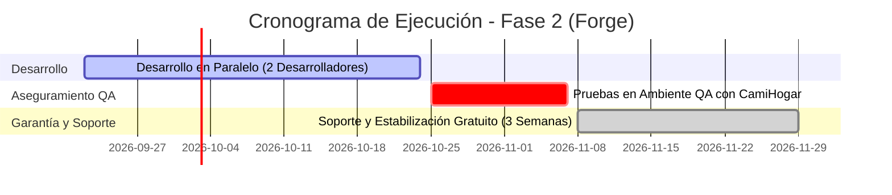

# Propuesta Comercial y Alcance Funcional: Plataforma "Forge" (Fase 2)

**Para:** CamiHogar  
**De:** Equipo de VerkkuTech  
**Fecha:** 21 de Septiembre de 2026  
**Documento:** Propuesta de Ampliación Operativa, Gestión de Inventarios y Business Intelligence  

---

## 1. Introducción y Contexto del Proyecto

En la primera etapa de la plataforma **Forge**, logramos digitalizar y centralizar con éxito el corazón comercial de CamiHogar: el catálogo de productos con sus atributos personalizables, la toma de pedidos, el registro de clientes, el seguimiento de entregas y el control multicurrency de abonos y pagos.

Esta nueva fase tiene como objetivo dar el salto hacia el **control logístico en tiempo real y la inteligencia de negocio**, conectando las tiendas físicas, los almacenes centrales y la toma de decisiones gerenciales en un solo flujo continuo y sin fricciones.

> **Sobre la denominación de "Forge":**  
> Aunque coloquialmente se le llama ERP, en la industria de software este tipo de sistema se clasifica con mayor precisión como un **ERP Operativo y Comercial (Vertical para Manufactura y Retail de Muebles)**. Cubre el 100% de la cadena de valor operativa (Venta $\rightarrow$ Reserva $\rightarrow$ Fabricación $\rightarrow$ Almacén $\rightarrow$ Despacho $\rightarrow$ Cobranza), dejando por fuera la contabilidad fiscal tradicional de partida doble y nómina, lo que lo hace mucho más ágil, intuitivo y adaptado exactamente a la realidad del negocio.

---

## 2. Alcance Funcional de la Fase 2

La presente ampliación se estructura en **4 pilares funcionales** diseñados para ser operados de forma sencilla por vendedores, coordinadores de almacén y gerencia:

### Pilar 1: Gestión de Inventario Inmediato y Multisede
* **Control de Existencias Físicas:** Visibilidad en tiempo real de qué piezas terminadas están en qué tienda física y cuáles están en los almacenes.
* **Carga Masiva y Registro Rápido:** Importación sencilla de existencias mediante plantillas de Excel y formularios rápidos de ingreso para piezas recién salidas de taller.
* **Sistema de Reserva Temporal Anti-Duplicidad:**
  * Al atender a un cliente y mostrar un producto, el sistema genera un apartado temporal de **5 a 10 minutos** para evitar que dos vendedores en distintas tiendas vendan el mismo mueble a la vez.
  * Si el cliente confirma la compra, se extiende automáticamente a **30 minutos** para completar el abono o registro formal de la orden. Transcurrido el tiempo sin pago, la pieza vuelve a estar disponible para todos automáticamente.
* **Reposición de Exhibición (Fabricación Interna):** Módulo para que taller fabrique piezas destinadas a stock de tienda sin generar ventas ficticias en la contabilidad.

### Pilar 2: Notificaciones Inteligentes, concretación de Reservas y Despacho
* **Centro de Notificaciones In-App y Alertas Sonoras por Rol:**
  * **Para el Equipo de Ventas Online ("Módulo de Repesca" / CRM):**
    * En el flujo de CamiHogar, las órdenes con estatus **Reserva** operan como presupuestos acordados con los clientes (creados por vendedores físicos u online).
    * Cuando un presupuesto/reserva acumula **más de 30 días sin concretarse en venta real**, el sistema alerta de forma centralizada al equipo de ventas online en su panel de notificaciones.
    * Funciona como un embudo de reactivación tipo CRM: el asesor online recibe el aviso directo, abre la ficha del cliente y lo contacta proactivamente (vía WhatsApp o llamada) para ofrecer alternativas, reactivar el interés y concretar la venta de presupuestos que de otro modo se perderían.
  * **Para Logística y Almacén (Alertas Sonoras y Visuales):**
    * Alerta instantánea (con aviso audible en el navegador) en el momento en que un producto sale de una tienda física por venta inmediata o retiro, permitiendo al depósito central (Terrinca) preparar de inmediato la carga de reposición.
* **Despacho Inteligente por Cercanía (Cálculo Invisible):** Sin necesidad de cargar ni interactuar con mapas lentos o complejos en pantalla, el sistema procesa en segundo plano y de forma 100% transparente la proximidad entre la dirección de entrega del cliente y las distintas sedes de CamiHogar. Durante la creación del pedido o al momento de su despacho, el sistema sugiere automáticamente la tienda o almacén más cercano que disponga de stock físico real, permitiendo confirmar o ajustar la sede de salida con un solo clic para optimizar tiempos y costos de flete.

### Pilar 3: Catálogo Visual y Galería de Fotos Reales de Taller
* **Alojamiento Propio de Imágenes:** Almacenamiento seguro de fotografías en alta definición y formato ligero (WebP) optimizado para no ralentizar el sistema.
* **Muestrario Visual ("Swatches"):** Círculos interactivos con la textura y color real de cada tela (Lino, Chenille, Semipiel, Terciopelo).
* **Galería de Trabajos Terminados:** Visor para que el vendedor o el cliente en web pueda filtrar y ver fotos reales de muebles ya fabricados y entregados con esa tela y color exactos.
* **Simulador Visual:** Herramienta interactiva para previsualizar al instante el cambio de tapizado sobre la foto del modelo.

### Pilar 4: Business Intelligence (BI) y Tableros Gerenciales
* **Finanzas y Cobranzas:** Seguimiento de facturación en USD, cobranza efectiva multicurrency (Bs / USD), saldos pendientes por cobrar y distribución de medios de pago (Zelle, Efectivo, Transferencias).
* **Eficiencia en Fábrica:** Tiempos promedio de fabricación por línea de producto (Camas, Closets, Comedores) y cumplimiento de fechas pactadas (OTIF).
* **Recomendaciones Inteligentes de Reposición:** Algoritmo que analiza el **Top 3 de combinaciones más vendidas** y alerta a gerencia qué productos conviene mandar a fabricar antes de que se agoten.

---

## 3. Entregables Complementarios (Garantía de Calidad)

Para garantizar una adopción exitosa y un uso fluido por parte de todo el equipo de CamiHogar, el proyecto incluye:
1. **Manuales de Usuario:** Guías paso a paso para Vendedores (cómo consultar stock y apartar) y Encargados de Almacén (cómo recibir alertas y cargar stock).
2. **Documentación Técnica de la Plataforma:** Arquitectura del sistema, catálogo de APIs y procedimientos de respaldo de datos e imágenes.
3. **Ambiente de Pruebas (QA):** Despliegue de un entorno de pruebas idéntico a producción para que el equipo de CamiHogar valide cada función antes del lanzamiento oficial.
4. **Capacitación y Puesta en Marcha:** Sesiones de inducción en vivo para el equipo comercial y logístico.

---

## 4. Plan de Trabajo y Cronograma de Entregas

El proyecto contará con un equipo dedicado de **2 desarrolladores de VerkkuTech** bajo el siguiente calendario:

* **Fase de Desarrollo Activo:** **4 a 5 semanas** (Entrega formal de funcionalidades).
* **Fase de Pruebas y Validación (QA):** **2 semanas** en ambiente de pruebas junto a los analistas de CamiHogar.
* **Fase de Garantía y Soporte Post-Lanzamiento:** **3 semanas de soporte técnico totalmente GRATIS** tras la aprobación en QA, acompañando la operación diaria en tiendas y almacenes.
* **Esquema Posterior:** Finalizadas las 3 semanas de garantía, se acordará un esquema de soporte y mantenimiento preventivo mensual según las necesidades operativas de CamiHogar.

---

## 5. Propuesta Económica e Inversión

| Concepto | Horas Estimadas | Tarifa por Hora | Subtotal |
|---|:---:|:---:|:---:|
| **Desarrollo de Software Integral (38 Requerimientos Funcionales)** | 322 h | $7,00 USD | $2.254,00 USD |
| **Documentación de Usuario, Manuales Operativos y Guías de Venta** | 16 h | $7,00 USD | $112,00 USD |
| **Documentación Técnica, Arquitectura y Procedimientos de Respaldo** | 10 h | $7,00 USD | $70,00 USD |
| **Pruebas de Calidad (QA), Validación de Concurrencia y UAT** | 20 h | $7,00 USD | $140,00 USD |
| **Capacitación del Personal y Acompañamiento en Puesta en Marcha** | 12 h | $7,00 USD | $84,00 USD |
| **SUBTOTAL DEL PROYECTO (380 Horas)** | **380 h** | **$7,00 USD** | **$2.660,00 USD** |
| **DESCUENTO ESPECIAL FASE 2 (-30%)** | — | — | **-$798,00 USD** |
| **INVERSIÓN TOTAL FINAL ACORDADA** | — | — | **$1.862,00 USD** |

---

## 6. Condiciones Comerciales y Forma de Pago Sugerida

Para brindar total tranquilidad y acompañar el avance visible del proyecto:
* **Hito 1 (Anticipo al inicio):** 35% a la firma y arranque del proyecto ($651,70 USD).
* **Hito 2 (Entrega a QA):** 35% al finalizar las 4-5 semanas de desarrollo y entregar en ambiente de pruebas ($651,70 USD).
* **Hito 3 (Puesta en Producción):** 30% a la culminación de las pruebas en QA y pase a producción ($558,60 USD).
* **Período de Gracia:** Inician de inmediato las **3 semanas de soporte y acompañamiento 100% gratuito**.

---
*Propuesta elaborada con orgullo por el equipo de **VerkkuTech** para seguir impulsando el crecimiento y liderazgo comercial de **CamiHogar**.*
