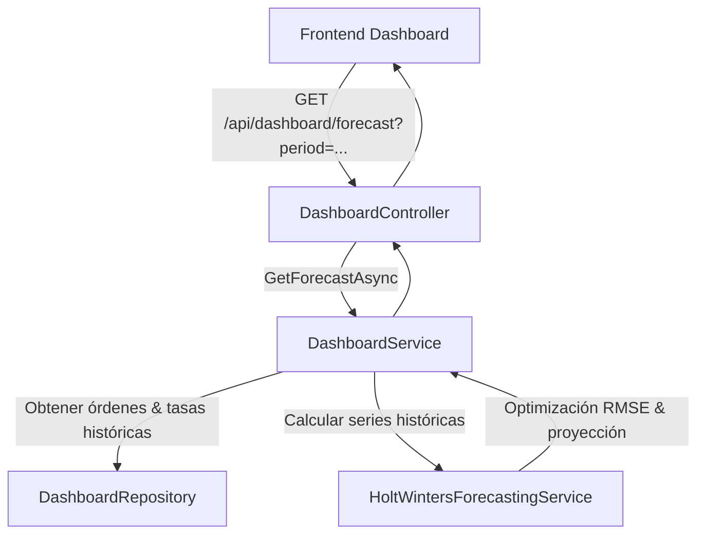

# Diseño Técnico: Motor de Pronóstico Econométrico Holt-Winters en .NET 10

## 1. Contexto y Objetivos
El dashboard gerencial de Camihogar requiere proyectar tanto **Facturación** como **Cobranza** de manera razonable, prudente y fundamentada estadísticamente:
- Evitar pronósticos arbitrarios o sobreoptimistas.
- Diferenciar gráficamente datos reales (líneas continuas) de datos proyectados (líneas punteadas).
- Considerar la estacionalidad (ciclo semanal o estacionalidad mensual a 12 meses con histórico de 3 años cuando el rango es anual).
- Ejecutarse de forma 100% nativa en **.NET 10 (C# puro)** sin librerías externas ni binarios C++, con un tiempo de respuesta inferior a 3 ms en Raspberry Pi 5 (ARM64).

---

## 2. Arquitectura de Componentes

### 2.1 Backend (`Ordina.Backend`)

- **`ITimeSeriesForecastingService`** (`Ordina.Application/Dashboard`):
  Interfaz genérica para pronósticos de series temporales.
- **`HoltWintersForecastingService`**:
  Implementación matemática de Triple Suavizado Exponencial Aditivo con Tendencia Amortiguada (*Damped Holt-Winters*).
- **`DashboardDTOs.cs`**:
  - `ForecastDataPointDto`: Contiene fecha, etiqueta, datos reales (`InvoicedUsd`, `CollectedUsd`), datos proyectados (`ProjectedInvoiced`, `ProjectedCollected`), y benchmark trienal (`Benchmark3Yr`).
  - `ForecastSummaryDto`: Totales proyectados para el periodo y métricas de ajuste del modelo (`MapeScore`, `Alpha`, `Beta`, `Gamma`).
  - `SalesForecastResponseDto`: Agrupa los puntos y el resumen.

---

## 3. Formulación Matemática del Modelo

### 3.1 Ecuaciones de Estado (Holt-Winters Damped Additive)
Para una serie observada $Y_t$ con periodo estacional $m$:
- **Nivel ($L_t$)**:
  $$L_t = \alpha (Y_t - S_{t-m}) + (1 - \alpha)(L_{t-1} + \phi b_{t-1})$$
- **Tendencia ($b_t$)**:
  $$b_t = \beta (L_t - L_{t-1}) + (1 - \beta)\phi b_{t-1}$$
- **Factor Estacional ($S_t$)**:
  $$S_t = \gamma (Y_t - L_t) + (1 - \gamma)S_{t-m}$$

Donde:
- $\alpha \in [0.10, 0.60]$: Parámetro de suavizado de nivel.
- $\beta \in [0.01, 0.20]$: Parámetro de suavizado de tendencia (acotado para evitar oscilaciones irreales).
- $\gamma \in [0.10, 0.50]$: Parámetro de estacionalidad.
- $\phi = 0.92$: Factor de amortiguación prudente (*damping factor*), que atenúa el crecimiento proyectado satisfaciendo el criterio de prudencia gerencial.

### 3.2 Pronóstico a $h$ pasos ($\hat{Y}_{t+h}$)
$$\hat{Y}_{t+h} = \max\left(0, L_t + \left( \sum_{i=1}^h \phi^i \right) b_t + S_{t-m + ((h-1) \pmod m) + 1}\right)$$

### 3.3 Calibración de Parámetros por Búsqueda en Cuadrícula (Grid Search)
El modelo ajusta automáticamente $(\alpha, \beta, \gamma)$ evaluando las predicciones un paso adelante (*one-step-ahead forecast*) sobre la serie histórica para minimizar el **RMSE**:
$$\text{RMSE} = \sqrt{\frac{1}{N} \sum_{t=1}^N (Y_t - \hat{Y}_t)^2}$$
Y reporta el **MAPE (Mean Absolute Percentage Error)** como métrica de interpretabilidad gerencial.

---

## 4. Estrategia según el Periodo del Dashboard

| Periodo | Frecuencia / Paso | Periodo Estacional $m$ | Histórico Requerido | Proyección |
| :--- | :--- | :--- | :--- | :--- |
| **`day`, `week`, `month`** | Diaria | $m = 7$ (ciclo semanal) | Últimos 180 días (6 meses) | Días restantes del mes actual |
| **`year`** | Mensual | $m = 12$ (ciclo anual) | Últimos 3 años (1095 días) | Meses restantes del año actual + Benchmark 3 años |

### 4.1 Benchmark Trienal Comparativo
En la vista anual, además de la proyección del año en curso, se calcula el promedio histórico mensual de los 3 años anteriores:
$$\text{Benchmark}_m = \frac{1}{3} \sum_{k=1}^3 Y_{m, \text{año}-k}$$
Permite contrastar si el ritmo proyectado del año actual supera o se alinea con el histórico real de la empresa.

---

## 5. Modelado Dual: Facturación vs Cobranza
1. **Facturación Proyectada**: Obtenida directamente del modelo Holt-Winters sobre la serie de montos facturados convertidos a USD.
2. **Cobranza Proyectada**: Modela la tasa de recuperación de cartera semestral con rezago:
   $$\text{Cobranza Proyectada}_t = \text{Facturación Proyectada}_t \times \text{TasaEfectivaCobro}$$
   Donde $\text{TasaEfectivaCobro} = \text{clamp}\left(\frac{\sum_{6\text{m}} \text{Cobrado}}{\sum_{6\text{m}} \text{Facturado}}, 0.35, 0.85\right)$.

---

## 6. Frontend: Visualización en Recharts (`trend-chart.tsx`)
- **Líneas Reales**:
  - `invoicedUsd`: Color esmeralda (`#10b981`), trazo continuo (`strokeDasharray="none"`).
  - `collectedUsd`: Color azul (`#3b82f6`), trazo continuo (`strokeDasharray="none"`).
- **Líneas Proyectadas**:
  - `projectedInvoiced`: Color esmeralda, trazo punteado (`strokeDasharray="5 5"`).
  - `projectedCollected`: Color azul, trazo punteado (`strokeDasharray="5 5"`).
  - El punto de corte (hoy o mes actual) comparte el valor real y el proyectado para eliminar huecos visuales.
- **Línea Benchmark**:
  - `benchmark3Yr`: Color violeta (`#8b5cf6`), trazo punteado fino (`strokeDasharray="3 3"`).
